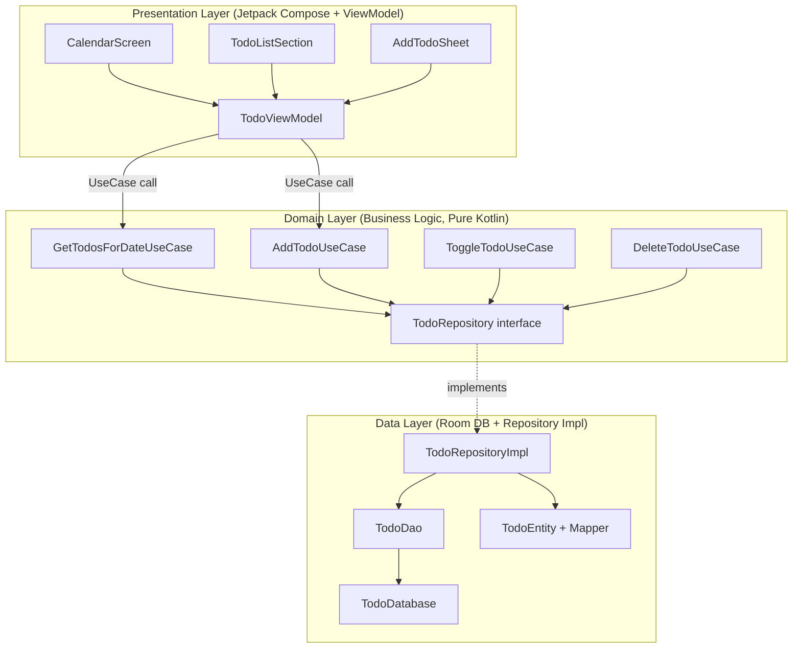
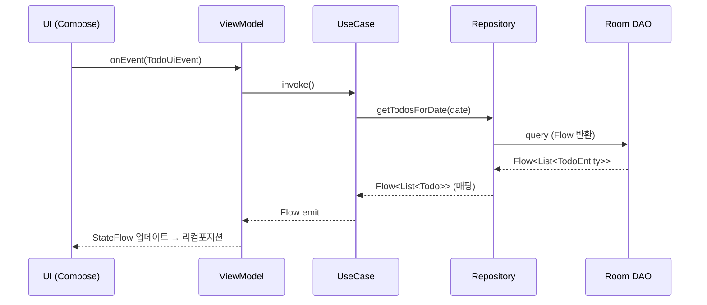

# TodoScheduler 아키텍처 문서

## 레이어 구조



## 데이터 흐름 (단방향)



## MVVM + MVI 하이브리드 설명

| 요소 | 패턴 | 이유 |
|------|------|------|
| `UiState` | MVI | 단일 상태 객체로 디버깅 용이 |
| `UiEvent` | MVI | 의도(Intent)를 명확하게 표현 |
| `UiEffect` | MVI | 일회성 이벤트 (Toast, Navigate) |
| `ViewModel` | MVVM | Android 생명주기 인식 |
| `Repository` | MVVM | 데이터 소스 추상화 |
| `UseCase` | Clean Arch | 비즈니스 로직 격리 |

## 핵심 상태 모델

```kotlin
data class TodoUiState(
    val selectedDate: LocalDate = LocalDate.now(),
    val todos: List<Todo> = emptyList(),
    val isLoading: Boolean = false,
    val error: String? = null
)

sealed class TodoUiEvent {
    data class SelectDate(val date: LocalDate) : TodoUiEvent()
    data class AddTodo(val title: String, val description: String = "") : TodoUiEvent()
    data class ToggleTodo(val id: Long) : TodoUiEvent()
    data class DeleteTodo(val id: Long) : TodoUiEvent()
}

sealed class TodoUiEffect {
    data class ShowSnackbar(val message: String) : TodoUiEffect()
    data object NavigateBack : TodoUiEffect()
}
```

## Room 스키마

| Column | Type | Constraint |
|--------|------|-----------|
| `id` (PK) | LONG | autoGenerate |
| `title` | TEXT | NOT NULL |
| `description` | TEXT | default `""` |
| `date` | LONG | LocalDate (TypeConverter) |
| `isCompleted` | BOOLEAN | default `false` |
| `createdAt` | LONG | timestamp (ms) |
