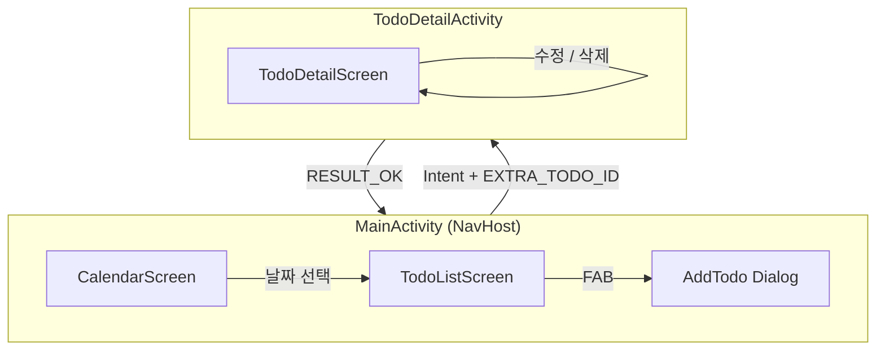
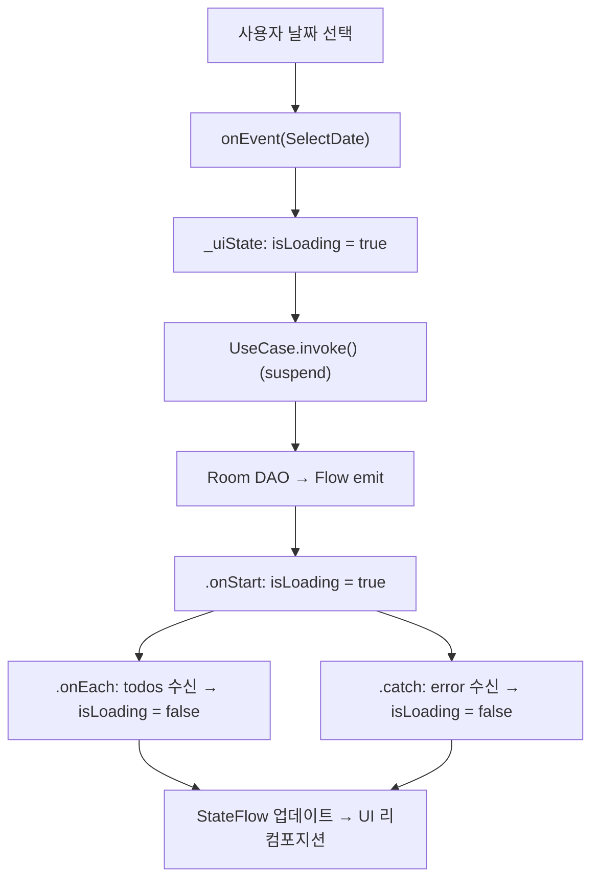
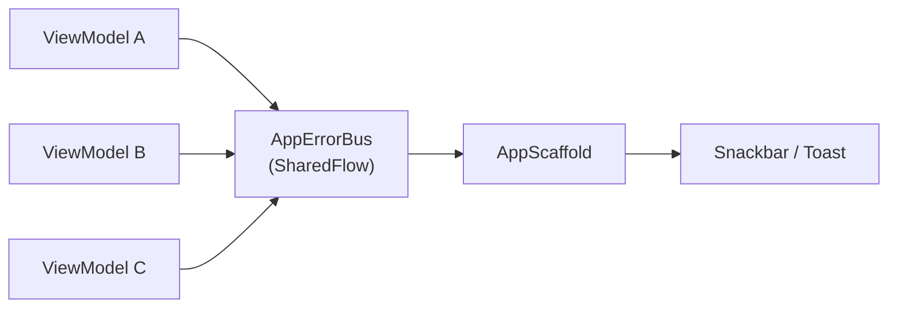
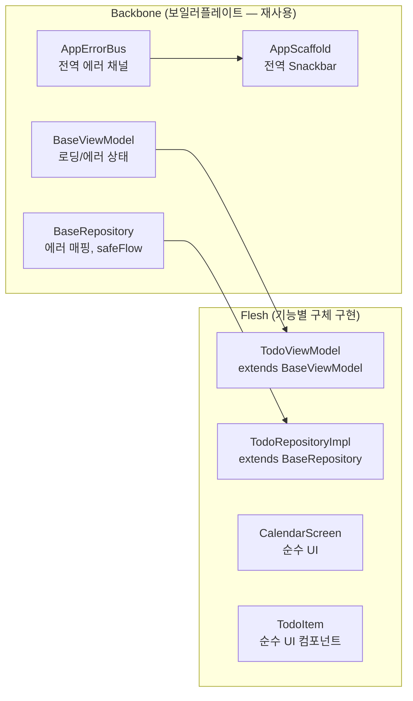

# 고급 패턴 가이드 — 5가지 아키텍처 심화

> 이 문서는 TodoScheduler에 적용할 5가지 고급 패턴을 상세히 설명합니다.
> 각 패턴은 BACKLOG.md의 스펙으로 분해되어 있습니다.

---

## 1. 멀티 Activity 화면 전환

### 왜 멀티 Activity인가?

현대 Android는 Single Activity를 권장하지만, **실무에서는 아직 멀티 Activity가 많습니다.** 두 가지를 모두 경험하는 게 현실적인 학습이 됩니다.

### 이 프로젝트의 Activity 분리 전략



**왜 Detail을 별도 Activity로?**

- `ActivityResultLauncher` 패턴 학습 (구버전 `startActivityForResult` 대체)
- `Intent`로 데이터 전달하는 방법 경험
- Back Stack 관리 학습
- Deep Link 진입점이 다를 때 유용한 실제 패턴

### 구현 방법

```kotlin
// 1. Activity 간 데이터 전달 — Intent에 ID 담기
val launcher = rememberLauncherForActivityResult(
    contract = ActivityResultContracts.StartActivityForResult()
) { result ->
    if (result.resultCode == Activity.RESULT_OK) {
        viewModel.onEvent(TodoUiEvent.RefreshList)
    }
}

// 이동 시
val intent = Intent(context, TodoDetailActivity::class.java).apply {
    putExtra(TodoDetailActivity.EXTRA_TODO_ID, todoId)
}
launcher.launch(intent)

// 2. TodoDetailActivity.kt
@AndroidEntryPoint
class TodoDetailActivity : ComponentActivity() {
    override fun onCreate(savedInstanceState: Bundle?) {
        super.onCreate(savedInstanceState)
        val todoId = intent.getLongExtra(EXTRA_TODO_ID, -1L)
        setContent { TodoDetailScreen(todoId = todoId) }
    }
    companion object { const val EXTRA_TODO_ID = "extra_todo_id" }
}
```

### Activity 전환 애니메이션

```kotlin
// 슬라이드 인 애니메이션
overrideActivityTransition(
    OVERRIDE_TRANSITION_OPEN,
    R.anim.slide_in_right,
    R.anim.slide_out_left
)
```

---

## 2. 로딩 애니메이션 — Suspend/Fetch 흐름

### Flow + Loading State 패턴



### 코드 패턴

```kotlin
// ViewModel — flatMapLatest로 날짜 변경 시 자동 갱신
private val _selectedDate = MutableStateFlow(LocalDate.now())

init {
    _selectedDate
        .onEach {
            _uiState.update { it.copy(isLoading = true, error = null) }
        }
        .flatMapLatest { date ->
            getTodosForDateUseCase(date)
        }
        .onEach { todos ->
            _uiState.update { it.copy(todos = todos, isLoading = false) }
        }
        .catch { e ->
            _uiState.update { it.copy(isLoading = false, error = e.message) }
        }
        .launchIn(viewModelScope)
}
```

### UI에서 로딩 상태 처리

```kotlin
@Composable
fun TodoScreen(uiState: TodoUiState) {
    Box(modifier = Modifier.fillMaxSize()) {
        when {
            uiState.isLoading -> {
                // 전체 화면 로딩
                CircularProgressIndicator(
                    modifier = Modifier.align(Alignment.Center)
                )
            }
            uiState.todos.isEmpty() -> EmptyState()
            else -> TodoList(uiState.todos)
        }

        // 목록 위에 오버레이 로딩 (새로고침 시)
        if (uiState.isRefreshing) {
            LinearProgressIndicator(modifier = Modifier.align(Alignment.TopCenter).fillMaxWidth())
        }
    }
}
```

### Shimmer Loading (스켈레톤 UI)

```kotlin
// 더 세련된 로딩: 스켈레톤 효과
@Composable
fun ShimmerTodoItem() {
    val transition = rememberInfiniteTransition()
    val alpha by transition.animateFloat(
        initialValue = 0.2f, targetValue = 0.9f,
        animationSpec = infiniteRepeatable(tween(800), RepeatMode.Reverse)
    )
    Box(
        modifier = Modifier
            .fillMaxWidth().height(60.dp)
            .background(Color.Gray.copy(alpha = alpha), RoundedCornerShape(8.dp))
    )
}
```

---

## 3. 전역 에러 핸들러 (Global Error Handler)

### 아키텍처



### 구현

```kotlin
// 1. AppError Sealed Class
sealed class AppError {
    data class NetworkError(val message: String) : AppError()
    data class DatabaseError(val message: String) : AppError()
    data class UnknownError(val message: String) : AppError()

    fun toUserMessage() = when (this) {
        is NetworkError -> "네트워크 오류: $message"
        is DatabaseError -> "저장 오류가 발생했습니다"
        is UnknownError -> message
    }
}

// 2. AppErrorBus — 앱 전역 에러 채널
object AppErrorBus {
    private val _errors = MutableSharedFlow<AppError>()
    val errors: SharedFlow<AppError> = _errors.asSharedFlow()

    suspend fun emit(error: AppError) = _errors.emit(error)
}

// 3. BaseViewModel — 모든 ViewModel의 공통 부모
abstract class BaseViewModel : ViewModel() {
    protected fun handleError(throwable: Throwable) {
        viewModelScope.launch {
            AppErrorBus.emit(AppError.UnknownError(throwable.message ?: "알 수 없는 오류"))
        }
    }
}

// 4. AppScaffold — 최상위 컴포저블에서 수집
@Composable
fun AppScaffold(content: @Composable () -> Unit) {
    val snackbarHostState = remember { SnackbarHostState() }
    val scope = rememberCoroutineScope()

    // 전역 에러 수집
    LaunchedEffect(Unit) {
        AppErrorBus.errors.collect { error ->
            scope.launch {
                snackbarHostState.showSnackbar(
                    message = error.toUserMessage(),
                    duration = SnackbarDuration.Short
                )
            }
        }
    }

    Scaffold(
        snackbarHost = { SnackbarHost(snackbarHostState) }
    ) { padding ->
        Box(modifier = Modifier.padding(padding)) { content() }
    }
}

// 5. MainActivity에서 AppScaffold로 감싸기
setContent {
    AppTheme {
        AppScaffold {
            AppNavHost()
        }
    }
}
```

---

## 4. Room 더 편하게 사용하기

### 4-1. TypeConverter 자동화 (기본)

```kotlin
// LocalDate, LocalDateTime 자동 변환
class Converters {
    @TypeConverter fun fromLocalDate(date: LocalDate?): Long? = date?.toEpochDay()
    @TypeConverter fun toLocalDate(epochDay: Long?): LocalDate? = epochDay?.let(LocalDate::ofEpochDay)
}
```

### 4-2. DatabaseView — 읽기 전용 뷰 (집계 쿼리)

```kotlin
// 날짜별 Todo 통계를 미리 집계하는 View
@DatabaseView("""
    SELECT date, COUNT(*) as totalCount,
           SUM(CASE WHEN isCompleted = 1 THEN 1 ELSE 0 END) as completedCount
    FROM todos GROUP BY date
""")
data class TodoSummaryView(
    val date: Long,
    val totalCount: Int,
    val completedCount: Int
)

// Dao에서 사용
@Dao
interface TodoSummaryDao {
    @Query("SELECT * FROM TodoSummaryView WHERE date = :dateEpoch")
    fun getSummaryForDate(dateEpoch: Long): Flow<TodoSummaryView?>
}
```

### 4-3. Relation — 엔티티 관계 (1:N)

```kotlin
// 미래 확장: 카테고리 ↔ Todo 1:N 관계
@Entity
data class CategoryEntity(@PrimaryKey val id: Long, val name: String)

data class CategoryWithTodos(
    @Embedded val category: CategoryEntity,
    @Relation(parentColumn = "id", entityColumn = "categoryId")
    val todos: List<TodoEntity>
)

@Query("SELECT * FROM categories")
fun getCategoriesWithTodos(): Flow<List<CategoryWithTodos>>
```

### 4-4. SQLDelight — Room 대안 ORM

```
Room vs SQLDelight 비교:
┌─────────────┬─────────────────────┬─────────────────────────┐
│ 항목         │ Room                │ SQLDelight              │
├─────────────┼─────────────────────┼─────────────────────────┤
│ 쿼리 방식   │ 어노테이션 + JPQL  │ .sq 파일에 순수 SQL              │
│ 컴파일 검증 │ 빌드 시 검증       │ IDE에서 실시간 검증     │
│ KMM 지원    │ Android only        │ iOS, Desktop도 지원     │
│ 학습 난이도 │ 쉬움               │ SQL 지식 필요           │
│ 타입 안전   │ O                  │ O (더 엄격)             │
└─────────────┴─────────────────────┴─────────────────────────┘
→ 이 프로젝트는 Room 유지 (Android 표준), SQLDelight는 선택 학습
```

### 4-5. Room Migration 전략

```kotlin
// 버전 업 시 스키마 마이그레이션
val MIGRATION_1_2 = object : Migration(1, 2) {
    override fun migrate(database: SupportSQLiteDatabase) {
        database.execSQL("ALTER TABLE todos ADD COLUMN priority INTEGER NOT NULL DEFAULT 0")
    }
}

Room.databaseBuilder(context, TodoDatabase::class.java, "todo.db")
    .addMigrations(MIGRATION_1_2)
    .build()
```

---

## 5. Backbone + Flesh 구조 (보일러플레이트 분리)

### 개념



### BaseViewModel

```kotlin
// 모든 ViewModel이 상속하는 공통 뼈대
abstract class BaseViewModel<Event, State, Effect>(
    initialState: State
) : ViewModel() {

    private val _uiState = MutableStateFlow(initialState)
    val uiState: StateFlow<State> = _uiState.asStateFlow()

    private val _effect = MutableSharedFlow<Effect>()
    val effect: SharedFlow<Effect> = _effect.asSharedFlow()

    abstract fun onEvent(event: Event)

    protected fun updateState(block: State.() -> State) {
        _uiState.update { it.block() }
    }

    protected fun sendEffect(effect: Effect) {
        viewModelScope.launch { _effect.emit(effect) }
    }

    protected fun launchWithLoading(
        setLoading: (Boolean) -> Unit,
        block: suspend () -> Unit
    ) {
        viewModelScope.launch {
            try {
                setLoading(true)
                block()
            } catch (e: Exception) {
                AppErrorBus.emit(AppError.UnknownError(e.message ?: "오류 발생"))
            } finally {
                setLoading(false)
            }
        }
    }
}

// 구체 구현 (Flesh)
class TodoViewModel @Inject constructor(
    private val getTodos: GetTodosForDateUseCase,
    private val addTodo: AddTodoUseCase
) : BaseViewModel<TodoUiEvent, TodoUiState, TodoUiEffect>(TodoUiState()) {

    override fun onEvent(event: TodoUiEvent) = when (event) {
        is TodoUiEvent.AddTodo -> launchWithLoading(
            setLoading = { updateState { copy(isLoading = it) } }
        ) {
            addTodo(event.title, event.description)
            sendEffect(TodoUiEffect.ShowSnackbar("추가되었습니다"))
        }
        is TodoUiEvent.SelectDate -> updateState { copy(selectedDate = event.date) }
        // ...
    }
}
```

### BaseRepository

```kotlin
// 에러 처리를 공통화한 Repository 베이스
abstract class BaseRepository {
    protected fun <T> safeFlow(block: suspend () -> Flow<T>): Flow<T> =
        flow { emitAll(block()) }
            .catch { e -> AppErrorBus.emit(AppError.DatabaseError(e.message ?: "DB 오류")) }

    protected suspend fun <T> safeCall(block: suspend () -> T): Result<T> =
        runCatching { block() }
            .onFailure { AppErrorBus.emit(AppError.DatabaseError(it.message ?: "DB 오류")) }
}

// 구체 구현
class TodoRepositoryImpl @Inject constructor(
    private val dao: TodoDao
) : BaseRepository(), TodoRepository {

    override fun getTodosForDate(date: LocalDate): Flow<List<Todo>> = safeFlow {
        dao.getTodosByDate(date).map { entities -> entities.map { it.toDomain() } }
    }

    override suspend fun addTodo(todo: Todo) = safeCall {
        dao.insertTodo(todo.toEntity())
    }
}
```

### Screen 템플릿 패턴 (Flesh가 따르는 구조)

```kotlin
// 모든 화면이 따르는 4-레이어 템플릿
// Layer 1: Route (Stateful, DI 포인트)
@Composable
fun XxxScreenRoute(
    navController: NavController,
    viewModel: XxxViewModel = hiltViewModel()
) {
    val uiState by viewModel.uiState.collectAsStateWithLifecycle()

    // 일회성 Effect 처리
    LaunchedEffect(viewModel.effect) {
        viewModel.effect.collect { effect ->
            when (effect) {
                is XxxUiEffect.Navigate -> navController.navigate(effect.route)
            }
        }
    }

    XxxScreen(uiState = uiState, onEvent = viewModel::onEvent)
}

// Layer 2: Screen (Stateless, 순수 UI)
@Composable
fun XxxScreen(uiState: XxxUiState, onEvent: (XxxUiEvent) -> Unit) {
    // 순수 UI 코드
}

// Layer 3: Preview (문서화 겸 개발 도구)
@Preview
@Composable
fun XxxScreenPreview() {
    XxxScreen(uiState = XxxUiState(), onEvent = {})
}
```

---

## 요약: 적용 비교

| 요소               | Before (기본 설계) | After (이 문서 적용)                |
| ------------------ | ------------------ | ----------------------------------- |
| Activity           | 1개 (MainActivity) | 2개 (Main + Detail)                 |
| 로딩 상태          | 단순 Boolean       | isLoading + isRefreshing + Shimmer  |
| 에러 처리          | 화면별 개별 처리   | AppErrorBus 전역 단일 채널          |
| ViewModel 공통로직 | 중복               | BaseViewModel 상속                  |
| Repository 에러    | 개별 try-catch     | BaseRepository.safeCall             |
| Room 쿼리          | 기본 CRUD          | + DatabaseView, Relation, Migration |
