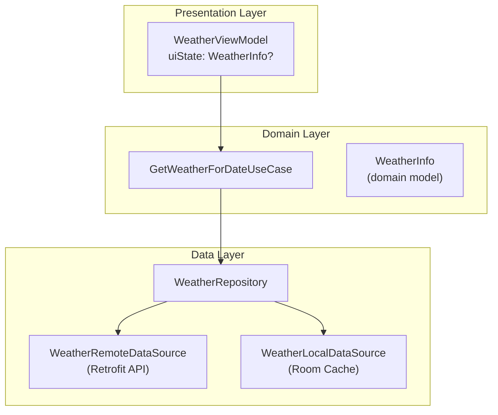
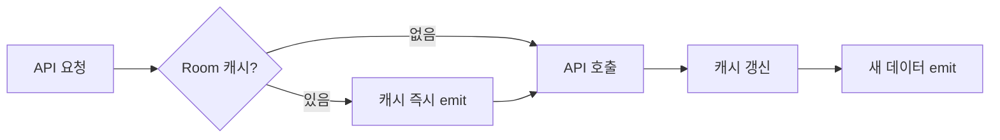

# API 연동 가이드 — 날씨 API로 배우는 네트워크 레이어

> **사용 API**: OpenWeatherMap (무료 티어, 가입 필요)
> 
> 날짜를 선택했을 때 그 날의 날씨를 함께 보여주는 기능을 추가합니다.
> 이를 통해 Retrofit, OkHttp, 오프라인 캐싱, API 키 보안까지 한 번에 학습합니다.

---

## 1. 기술 스택 선택 — Retrofit vs Ktor

| | Retrofit | Ktor Client |
|--|----------|-------------|
| 패러다임 | 어노테이션 기반 인터페이스 | 빌더 기반 DSL |
| Kotlin 친화성 | 코루틴 지원 (2.x) | 네이티브 Coroutines |
| KMM 지원 | Android only | iOS, Desktop 동시 지원 |
| 학습 곡선 | 낮음 (직관적) | 중간 |
| 생태계 | 매우 성숙 | 성장 중 |
| **채택** | ✅ **이 프로젝트** | 참고용 |

> **이유**: Retrofit은 Android 표준 네트워크 라이브러리로 가장 많이 사용되며,
> 기존 REST API 지식을 그대로 활용 가능합니다.

---

## 2. 네트워크 레이어 아키텍처



**Offline-First 전략:**



---

## 3. API 키 보안 관리

> ❌ **절대 금지**: API 키를 코드에 직접 하드코딩하거나 git에 올리는 것

### 올바른 방법: `local.properties` + `BuildConfig`

```properties
# local.properties (이미 .gitignore에 포함되어 있음)
WEATHER_API_KEY=your_openweathermap_api_key_here
```

```kotlin
// app/build.gradle.kts
android {
    defaultConfig {
        buildConfigField(
            "String",
            "WEATHER_API_KEY",
            "\"${project.findProperty("WEATHER_API_KEY") ?: ""}\""
        )
    }
    buildFeatures { buildConfig = true }
}
```

```kotlin
// 코드에서 사용
val apiKey = BuildConfig.WEATHER_API_KEY
```

---

## 4. Retrofit 설정 전체 구조

### 4-1. API 응답 데이터 클래스 (kotlinx.serialization)

```kotlin
// data/remote/dto/WeatherResponseDto.kt
@Serializable
data class WeatherResponseDto(
    val weather: List<WeatherDto>,
    val main: MainDto,
    val name: String,           // 도시 이름
    val dt: Long                // Unix timestamp
)

@Serializable
data class WeatherDto(
    val id: Int,
    val main: String,           // "Clear", "Rain", "Clouds" ...
    val description: String,
    val icon: String            // "01d", "02n" ...
)

@Serializable
data class MainDto(
    val temp: Double,
    val feels_like: Double,
    @SerialName("temp_min") val tempMin: Double,
    @SerialName("temp_max") val tempMax: Double,
    val humidity: Int
)
```

### 4-2. Retrofit API 인터페이스

```kotlin
// data/remote/api/WeatherApi.kt
interface WeatherApi {
    // 현재 날씨 (당일)
    @GET("weather")
    suspend fun getCurrentWeather(
        @Query("q") city: String,
        @Query("appid") apiKey: String = BuildConfig.WEATHER_API_KEY,
        @Query("units") units: String = "metric",
        @Query("lang") lang: String = "kr"
    ): WeatherResponseDto

    // 5일 예보 (3시간 간격, 미래 날짜용)
    @GET("forecast")
    suspend fun getWeatherForecast(
        @Query("q") city: String,
        @Query("appid") apiKey: String = BuildConfig.WEATHER_API_KEY,
        @Query("units") units: String = "metric",
        @Query("lang") lang: String = "kr"
    ): ForecastResponseDto
}
```

### 4-3. OkHttp 인터셉터

```kotlin
// 로깅 인터셉터 — 요청/응답을 Logcat에 출력 (디버그에서만)
val loggingInterceptor = HttpLoggingInterceptor().apply {
    level = if (BuildConfig.DEBUG) {
        HttpLoggingInterceptor.Level.BODY  // 전체 본문 로깅
    } else {
        HttpLoggingInterceptor.Level.NONE  // 릴리즈에서 비활성화
    }
}

// 재시도 인터셉터 — 네트워크 오류 시 자동 재시도
class RetryInterceptor(private val maxRetries: Int = 3) : Interceptor {
    override fun intercept(chain: Interceptor.Chain): Response {
        var attempt = 0
        var lastException: IOException? = null
        while (attempt < maxRetries) {
            try { return chain.proceed(chain.request()) }
            catch (e: IOException) { lastException = e; attempt++ }
        }
        throw lastException!!
    }
}
```

### 4-4. NetworkModule (Hilt)

```kotlin
// di/NetworkModule.kt
@Module
@InstallIn(SingletonComponent::class)
object NetworkModule {
    private const val BASE_URL = "https://api.openweathermap.org/data/2.5/"

    @Provides @Singleton
    fun provideOkHttpClient(): OkHttpClient = OkHttpClient.Builder()
        .addInterceptor(HttpLoggingInterceptor().apply {
            level = if (BuildConfig.DEBUG) HttpLoggingInterceptor.Level.BODY
                    else HttpLoggingInterceptor.Level.NONE
        })
        .connectTimeout(30, TimeUnit.SECONDS)
        .readTimeout(30, TimeUnit.SECONDS)
        .build()

    @Provides @Singleton
    fun provideRetrofit(okHttpClient: OkHttpClient): Retrofit = Retrofit.Builder()
        .baseUrl(BASE_URL)
        .client(okHttpClient)
        .addConverterFactory(
            Json { ignoreUnknownKeys = true }.asConverterFactory("application/json".toMediaType())
        )
        .build()

    @Provides @Singleton
    fun provideWeatherApi(retrofit: Retrofit): WeatherApi = retrofit.create(WeatherApi::class.java)
}
```

---

## 5. NetworkResult — API 응답 래퍼

```kotlin
// core/NetworkResult.kt
sealed class NetworkResult<out T> {
    data class Success<T>(val data: T) : NetworkResult<T>()
    data class Error(val code: Int?, val message: String) : NetworkResult<Nothing>()
    data object Loading : NetworkResult<Nothing>()
}

// 확장 함수 — safeApiCall
suspend fun <T> safeApiCall(apiCall: suspend () -> T): NetworkResult<T> {
    return try {
        NetworkResult.Success(apiCall())
    } catch (e: HttpException) {
        NetworkResult.Error(e.code(), e.message())
    } catch (e: IOException) {
        NetworkResult.Error(null, "네트워크 연결을 확인해주세요")
    } catch (e: Exception) {
        NetworkResult.Error(null, e.message ?: "알 수 없는 오류")
    }
}
```

---

## 6. 캐싱 전략 — Offline-First

```kotlin
// data/local/entity/WeatherCacheEntity.kt
@Entity(tableName = "weather_cache")
data class WeatherCacheEntity(
    @PrimaryKey val dateKey: String,   // "2024-03-21"
    val condition: String,             // "맑음"
    val tempCelsius: Float,
    val iconCode: String,
    val cachedAt: Long = System.currentTimeMillis()
)

// WeatherRepositoryImpl.kt — Offline-First 패턴
class WeatherRepositoryImpl @Inject constructor(
    private val api: WeatherApi,
    private val cacheDao: WeatherCacheDao
) : BaseRepository(), WeatherRepository {

    override fun getWeather(date: LocalDate, city: String): Flow<WeatherInfo?> = flow {
        // 1. 캐시 즉시 emit
        val cached = cacheDao.getWeather(date.toString())
        if (cached != null) emit(cached.toDomain())

        // 2. 캐시 유효성 확인 (1시간 이내)
        val isCacheValid = cached != null &&
            System.currentTimeMillis() - cached.cachedAt < 3_600_000

        if (!isCacheValid) {
            // 3. API 호출
            val result = safeApiCall { api.getCurrentWeather(city) }

            when (result) {
                is NetworkResult.Success -> {
                    val entity = result.data.toEntity(date)
                    cacheDao.upsert(entity)      // 4. 캐시 갱신
                    emit(entity.toDomain())       // 5. 새 데이터 emit
                }
                is NetworkResult.Error -> {
                    AppErrorBus.emit(AppError.NetworkError(result.message))
                    // 캐시 데이터로 fallback (이미 emit됨)
                }
                else -> {}
            }
        }
    }
}
```

---

## 7. UI 연동 — CalendarScreen에서 날씨 표시

```kotlin
// TodoUiState에 날씨 정보 추가
data class TodoUiState(
    val selectedDate: LocalDate = LocalDate.now(),
    val todos: List<Todo> = emptyList(),
    val weather: WeatherInfo? = null,        // ← 추가
    val isWeatherLoading: Boolean = false,   // ← 추가
    val isLoading: Boolean = false,
    val error: String? = null
)

// UI 표현
@Composable
fun WeatherBadge(weather: WeatherInfo?) {
    weather ?: return
    Row(
        verticalAlignment = Alignment.CenterVertically,
        modifier = Modifier
            .clip(RoundedCornerShape(20.dp))
            .background(MaterialTheme.colorScheme.surfaceVariant)
            .padding(horizontal = 12.dp, vertical = 6.dp)
    ) {
        // 날씨 아이콘 (emoji 또는 AsyncImage)
        Text(text = weather.iconEmoji, style = MaterialTheme.typography.bodyLarge)
        Spacer(Modifier.width(6.dp))
        Text(
            text = "${weather.tempCelsius.toInt()}°C  ${weather.condition}",
            style = MaterialTheme.typography.bodyMedium
        )
    }
}
```

---

## 8. 배울 수 있는 개념 정리

| 개념 | 위치 | 설명 |
|------|------|------|
| Retrofit 인터페이스 | `WeatherApi.kt` | `@GET`, `@Query`, `suspend` |
| OkHttp 인터셉터 | `NetworkModule.kt` | 로깅, 재시도 인터셉터 |
| `kotlinx.serialization` | `WeatherResponseDto.kt` | `@Serializable`, `@SerialName` |
| API 키 보안 | `local.properties` → `BuildConfig` | Git에 키 노출 방지 |
| `NetworkResult<T>` | `safeApiCall()` | 성공/실패/로딩 상태 sealed class |
| Offline-First | `WeatherRepositoryImpl.kt` | 캐시 우선 → API fallback |
| Hilt Module | `NetworkModule.kt` | `@Singleton` OkHttp/Retrofit 제공 |
| Flow 기반 캐싱 | Repository | 캐시 emit 후 API 결과 재emit |
